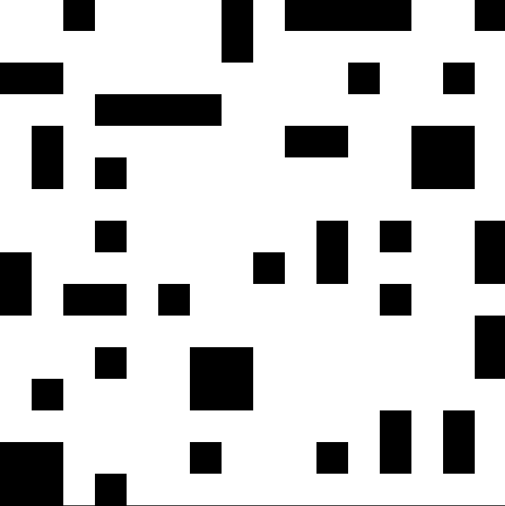

## Blocking Patterns: _Pattern generation through stochastic SAT solving_

Alpha Release Version

### What are '_blocking patterns_'? 

Suppose that you have an _n_ x _n_ grid of cells, where each cell must be coloured either _black_ or _white_. 

A _blocking pattern_ is an _h_ x _w_ bitmask, where 1 ≤ _h, w_ ≤ _n_, which when applied to a subset of our grid, if we
have a match between wherever the mask is _true_ and where the grid subset is coloured _black_, then the entire grid
subset must be coloured _black_.

For example, suppose we have the _blocking pattern_ [[1, 0], [0, 1]]. When we overlay the mask on our grid, over the cells 
_(i, j)_, _(i, j + 1)_, _(i + 1, j)_ and _(i + 1, j + 1)_, we get that if two diagonally opposite cells _(i, j)_ and 
_(i + 1, j + 1)_ are coloured black, then so must be the cells _(i, j + 1)_ and _(i + 1, j)_. 

Hence the name _blocking pattern_ - a pattern which when matched, forces an entire _black_ coloured block to be
drawn.

If we think of the colours _black_ and _white_ as _true_ and _false_ respectively, and the variable x(i, j) 
refers to the truth value associated with the cell _(i, j)_, we can translate this _blocking pattern_ into an implication:

( xi, j ∧ xi + 1, j + 1 ) ⇒ ( xi, j + 1 ∧ xi + 1, j )

In general, one can translate a set of _blocking patterns_ into a number of implications for each valid position where the
bitmask can be overlayed. Our goal is to generate a colouring of our grid such that this list of implications is satisfied.

#### Example:

Considering a _16_ x _16_ grid and applying the two complementary blocking patterns 

[[1, 0], [0, 1]] and [[0, 1], [1, 0]]

we get the following valid cell colouring:

### Installation

This utility requires the `ALLLSatisfiabilitySolver` library to be installed, which is available at https://github.com/xmif1/ALLLSatisfiabilitySolver. 

Once installed, clone this repository and `cd` into the project directory. Then run:

1. `mkdir ./build`
2. `cd ./build`
3. `cmake ..`
4. `make`

